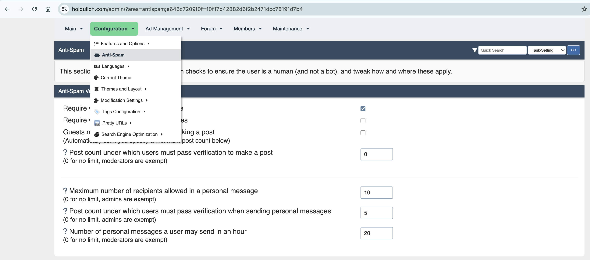
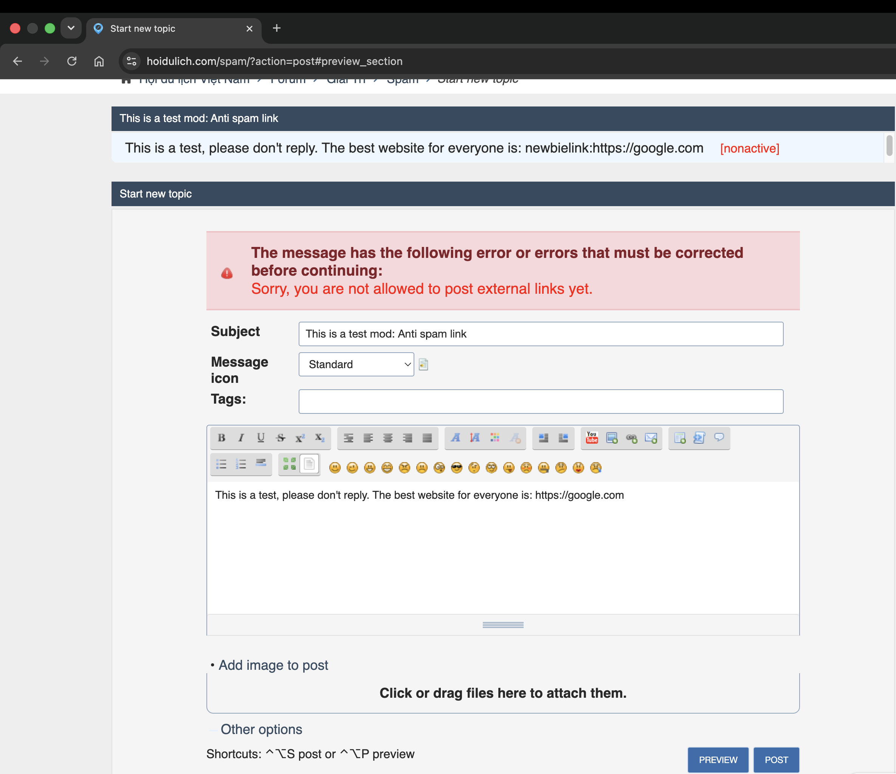

# Anti-Spam Links for SMF 2.1.x

A modern SMF 2.1.x compatible version of the classic Anti-Spam Links modification.
## Screenshots

### Settings

### Example

## Features

- Restrict external links for new members
- Restrict links for guests
- Convert links into plain text
- Add rel="nofollow"
- Supports:
  - Posting
  - Quick Edit
  - Preview
  - Signatures
- Hook-based implementation
- No SMF core modifications

## Installation

1. Download the package
2. Go to Admin → Package Manager
3. Upload the package
4. Click Install

## Compatibility

- SMF 2.1.6
- SMF 2.1.7
- PHP 7.4+
- PHP 8.x

## Credits

Based on the original Anti-Spam Links mod:

https://custom.simplemachines.org/mods/index.php?mod=2404

SMF 2.1.x Port and Rewrite:
Thanh Nguyen (hoidulich.com)

## License

BSD 3-Clause License
